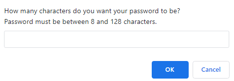

<h1 align="center">🔒 Make Me A Password 🔒</h1>

```sh

Have you ever been frustrated with not being able to create a password, especially given all the different requirements each website or application needs?  I have solved that problem with this awesome tool, which will easily create a password for you and save you time and headaches.

```

### 🏠 Homepage
```sh
https://stbuiemory.github.io/Sandy-Bui-Portfolio/
```

## 💻 Installation

```sh
- We were given an incomplete starter code to review, analyze and adjust to meet certain criteria.
- The application needs to generate a password with a length between 8-128 characters whilst giving the user the choice between lower case, upper case, numbers and special characters.
```
## 🎬 Usage
```sh
- Below is a screenshot and the window prompts the user will see.
```




## ⚙️ Testing

```sh
🛠️ The website launched well; however, I did experience (1) issue. It concerns the special characters prompt, of which resulted in "undefined" at times.
```

## 🤝 Contributing

There were no contributors on this project.

## 📝 License

MIT License

Copyright (c) 2023 Sandy Bui

Permission is hereby granted, free of charge, to any person obtaining a copy of this software and associated documentation files (the "Software"), to deal in the Software without restriction, including without limitation the rights to use, copy, modify, merge, publish, distribute, sublicense, and/or sell copies of the Software, and to permit persons to whom the Software is furnished to do so, subject to the following conditions:

The above copyright notice and this permission notice shall be included in all copies or substantial portions of the Software.

THE SOFTWARE IS PROVIDED "AS IS", WITHOUT WARRANTY OF ANY KIND, EXPRESS OR IMPLIED, INCLUDING BUT NOT LIMITED TO THE WARRANTIES OF MERCHANTABILITY, FITNESS FOR A PARTICULAR PURPOSE AND NONINFRINGEMENT. IN NO EVENT SHALL THE AUTHORS OR COPYRIGHT HOLDERS BE LIABLE FOR ANY CLAIM, DAMAGES OR OTHER LIABILITY, WHETHER IN AN ACTION OF CONTRACT, TORT OR OTHERWISE, ARISING FROM, OUT OF OR IN CONNECTION WITH THE SOFTWARE OR THE USE OR OTHER DEALINGS IN THE SOFTWARE.